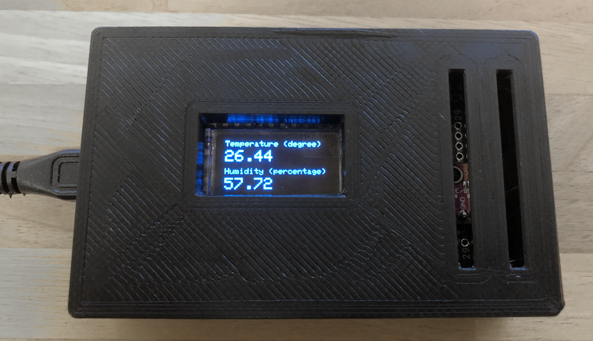
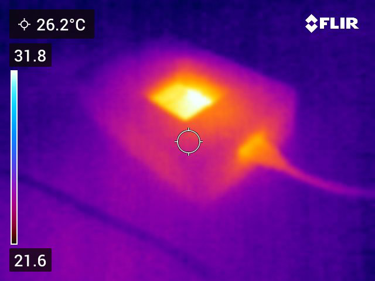
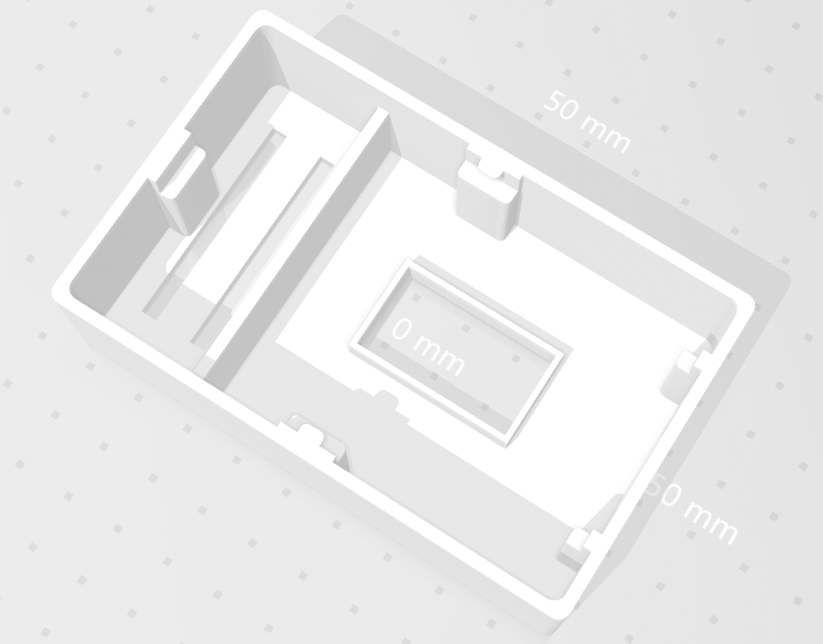
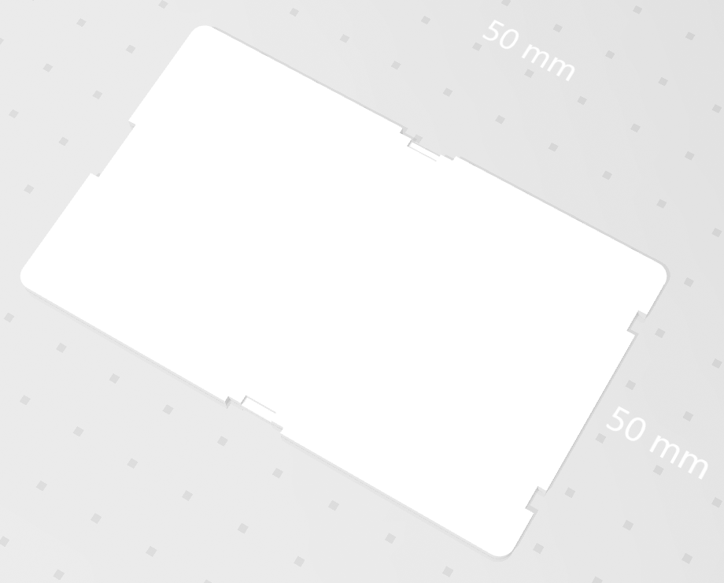

# LTS - LoRa Temperature Sensor
A Temperature Sensor connected via LoRa with a Master Module with a WLAN connection.

The aim of this project is to record the temperatures of the individual units in a small apartment complex in order to obtain an overall picture of the heating and cooling performance. The sensor data of the slave modules are then sent via LoRa to the master module. This then forwards the data via WLAN to a cloud service. This means that each slave module does not have to have its own WLAN configuration.

## LoRa

### RSSI
The Received Signal Strength Indication (RSSI) is the received signal power in milliwatts and is measured in dBm.
This value can be used as a measurement of how well a receiver can "hear" a signal from a sender.
The closer to 0 the better the signal is, RSSI `minimum is -120dBm`.

- `-30dBm` signal is strong
- `-120dBm` signal is weak

### Tools

- https://loratools.nl/#/airtime
- https://dramco.be/tools/lora-calculator/

## Findings

### Housing optimizations

The first housing variant (V1) still had few openings due to the additional optimization, the sensor now reacts faster to changes. The current housing variant is (V2)

### Temperature rise due the BME280 (Humidity & Pressure Sensor)

In the beginning, the temperature always increased the same when I put my sensor into operation. After a little research I then found out that the standard configuration makes 1000 queries per second and thus the temperature sensor heats up this I have now solved so that I manually trigger the sensor to query the temperature value and this now happens only 1 time per second.

### Temperature rise due to the esp32 (CPU)

When measuring with a thermal imaging camera, it is now clearly visible that the `ESP32` heats up the housing disadvantageously in continuous operation and influences the temperature measurement with a very high probability. The next development steps therefore go in the direction of deep sleep to improve this behavior. After my first tests in deep sleep I could see a temperature difference of `1.5°` which is the `deep sleep` code optimization.

### Sensor configuration

Adjusting the sensor name each time in the code before compiling was very inconvenient and error-prone. Since the ESP32 has no EEPROM I have now stored the values in the flash via the `Preferences` library.

### LoRa 2 LoRa communication

[lora-serialization](https://github.com/thesolarnomad/lora-serialization), [CayenneLPP](https://www.thethingsnetwork.org/docs/devices/arduino/api/cayennelpp/), [protobuf](https://github.com/protocolbuffers/protobuf) The protocols are too complicated to implement a simple device-to-device communication.

## Used Hardware

- [1x Heltec - WIFI LoRa 32 - V2.1 (SX1276)](https://amzn.to/3NMaJKi)
- [1x AZDelivery GY-BME280 Temperature Sensor](https://amzn.to/3Aph1wp)
- [1x Prototype Board](https://amzn.to/3OXw8Bc)

## Used Software Packages

- [espressif - arduino-esp32](https://raw.githubusercontent.com/espressif/arduino-esp32/gh-pages/package_esp32_index.json)
  (httpclient is more up to date than like heltec)
- [sandeepmistry - arduino-LoRa](https://github.com/sandeepmistry/arduino-LoRa)
- [adafruit - Adafruit_BME280](https://github.com/adafruit/Adafruit_BME280_Library)
- [adafruit - Adafruit_SSD1306](https://github.com/adafruit/Adafruit_SSD1306)

## Housing

 

## Sensor data targets

| Tool | Description |
| --------------------------- | ------------- |
| https://iotplotter.com      | Simple tool to visualize fast data but there is no real configuration for the endpoints |
| https://datagekko.com       | Currently not yet available is in a closed beta |
| https://iotguru.live        | Not tested |
| https://thingspeak.com      | Not tested |
| https://thingsboard.io      | Not tested |

